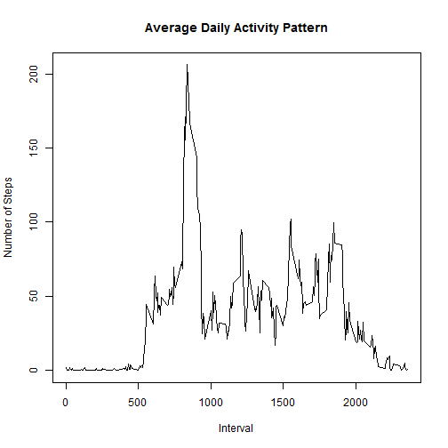

---
title: "Reproducible Research: Peer Assessment 1"
output: 
  html_document:
    keep_md: true
---


## Loading and preprocessing the data


```r
library(ggplot2)
setwd("C:/Users/summers.forest/R/Coursera/4. Reproducible Research")
activity <- read.csv(file = "activity.csv",sep=",",stringsAsFactors = FALSE)
activity.complete <- activity[complete.cases(activity),]
```

## What is mean total number of steps taken per day?


```r
activity.complete$date <- as.factor(activity.complete$date)
sum <- sapply(split(activity.complete$steps, activity.complete$date), sum)
hist(sum, main = "Total Number of Steps Taken Per Day")
```


```r
median(sum)
```

```
## [1] 10765
```

```r
mean(sum)
```

```
## [1] 10766.19
```

## What is the average daily activity pattern?


```r
mean_by_interval <- lapply(split(activity.complete$steps, activity.complete$interval), mean);
mean_by_interval <- data.frame(mean_by_interval);
mean_by_interval <- data.frame(t(mean_by_interval));
a <- row.names(mean_by_interval);
mean_by_interval$interval <- gsub("X","",a);
colnames(mean_by_interval)[1] <- "Steps";
mean_by_interval_1 <- mean_by_interval
plot(mean_by_interval$interval , mean_by_interval$Steps , type = "l", main = "Average Daily Activity Pattern", xlab = "Interval", ylab = "Number of Steps")
```



```r
mean_by_interval <- mean_by_interval[order(-mean_by_interval$Steps),]
head(mean_by_interval$interval,1)
```

```
## [1] "835"
```

## Imputing missing values


```r
print("total number of missing values in the dataset")
```

```
## [1] "total number of missing values in the dataset"
```

```r
nrow(activity) - nrow(activity.complete)
```

```
## [1] 2304
```

```r
head(activity)
```

```
##   steps       date interval
## 1    NA 2012-10-01        0
## 2    NA 2012-10-01        5
## 3    NA 2012-10-01       10
## 4    NA 2012-10-01       15
## 5    NA 2012-10-01       20
## 6    NA 2012-10-01       25
```

```r
activity_na <- activity[which(is.na(activity$steps)),]

mean_by_interval_1$Steps_r <-  round(mean_by_interval_1$Steps,0)
mean_by_interval_1$Steps <- NULL

activity_na_i <- merge(activity_na, mean_by_interval_1, by = "interval")
activity_na_i$csteps <- NULL
activity_na_i$Steps <- NULL

activity_filled <- data.frame(steps = activity_na_i$Steps_r, date = activity_na_i$date, interval = activity_na_i$interval)

activity.complete_without_na <- rbind(activity_filled,activity.complete)

print("New DataSet is Called activity.complete_without_na.  It replaced na values with mean number of steps taken for each interval")
```

```
## [1] "New DataSet is Called activity.complete_without_na.  It replaced na values with mean number of steps taken for each interval"
```

```r
activity.complete_without_na$date <- as.factor(activity.complete_without_na$date)
sum <- sapply(split(activity.complete_without_na$steps, activity.complete_without_na$date), sum)
hist(sum, main = "Total Number of Steps Taken Per Day")
```


```r
median(sum)
```

```
## [1] 10762
```

```r
mean(sum)
```

```
## [1] 10765.64
```

```r
print("It is much higher")
```

```
## [1] "It is much higher"
```

## Are there differences in activity patterns between weekdays and weekends?


```r
activity.complete_without_na$date <- as.Date(activity.complete_without_na$date)

weekday_flag <- function(x) {
    y <- weekdays(x)
    if (y %in% c("Monday", "Tuesday", "Wednesday", "Thursday", "Friday")) 
        return("weekday") else if (y %in% c("Saturday", "Sunday")) 
        return("weekend") else stop("not a date")
}

activity.complete_without_na$week_part <- sapply(activity.complete_without_na$date, FUN = weekday_flag)

final <- aggregate(steps ~ interval + week_part, data = activity.complete_without_na, mean)

ggplot(final, aes(interval, steps)) + geom_line() + facet_grid(week_part ~ .) + 
    xlab("Interval") + ylab("Number of Steps")
```


